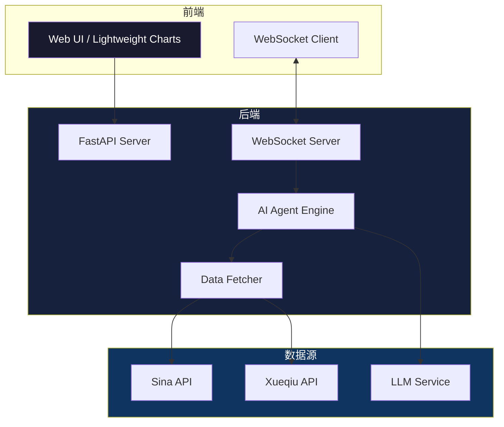

# 📈 DSA Core - AI 驱动量化分析终端


<p align="center">
  
</p>

<p align="center">
  <b>🚀 下一代 AI 量化分析终端 — 让交易决策更智能、更高效</b>
</p>

DSA Core 是一款集成了 **实时行情展示**、**AI 策略推理**、**持仓图像诊断** 以及 **舆情监测** 的一站式量化分析控制台。项目采用 Python FastAPI 作为后端核心引擎，前端借助 TradingView Lightweight Charts 打造极简、流畅且具科技感的暗黑风交易终端。

---

## 📸 终端预览

> 💡 **提示**：请将您的项目截图保存至 `docs/assets/` 目录，并替换以下占位图链接。

### 1. 核心看板与行情走势

<p align="center">
  
</p>

*💡 支持实时行情 K 线渲染、AI 深度逻辑诊断、核心入场/止损/目标位演算及实时舆情监测。*

### 2. AI 持仓识图诊断

<p align="center">
  
</p>

*🧠 上传股票持仓/盘口截图，AI 引擎自动识别股票代码与成本，并实时输出加减仓策略。*

---

## ✨ 核心特性

| 特性 | 说明 |
|------|------|
| ⚡ **毫秒级 WebSockets** | 前端 UI 与后端实时保持长连接，实现 K 线数据与 AI 分析结论的无缝推送 |
| 📊 **交互式 TradingView 图表** | 基于 `lightweight-charts` 打造，完美支持自适应缩放与流畅的 K 线渲染 |
| 🧠 **AI 大模型逻辑演算** | 集成多模态 LLM，提供交易策略生成（包含建议入场价、配置权重、硬止损位及目标收益价） |
| 📷 **多模态持仓识图** | 支持图片上传诊断，一键提取截图信息并给出针对性盘口分析 |
| 🛡️ **高容错与网络自愈** | 内置断线重连、数据清洗降级以及网络异常自动提示机制 |
| 🚀 **一键极速启动** | 提供开箱即用的 Python 启动引擎，无需繁琐的命令行配置 |
| 📰 **实时舆情监测** | 整合新闻、社交媒体情绪分析，辅助判断市场情绪 |
| 📉 **策略回测引擎** | 支持历史数据回测，可视化评估策略表现 |


---

## 🏗️ 系统架构图


---

## 🛠️ 技术栈

### 后端 (Backend)

| 技术 | 用途 |
|------|------|
| **Python 3.10+** | 核心编程语言 |
| **FastAPI** | 高性能异步 Web 框架 |
| **Uvicorn** | ASGI 服务器 |
| **WebSockets** | 实时双向通信 |
| **Pydantic** | 数据验证与序列化 |

### 前端 (Frontend)

| 技术 | 用途 |
|------|------|
| **HTML5 / CSS3** | 页面结构与样式 |
| **Tailwind CSS** | 实用优先的 CSS 框架 |
| **Lightweight Charts v4** | TradingView 开源图表库 |
| **Vanilla JavaScript** | 交互逻辑与 WebSocket 连接 |

### AI 与数据

| 技术 | 用途 |
|------|------|
| **LangChain** | AI Agent 编排框架 |
| **多模态 LLM** | 视觉识别与文本推理 |
| **Sina / Xueqiu API** | 实时行情数据源 |
| **Pandas / NumPy** | 数据处理与计算 |

---

## 📦 快速开始

### 1. 克隆项目与安装依赖

```bash
# 克隆仓库
git clone https://github.com/your-username/dsa_core.git
cd dsa_core

# 安装依赖项
pip install fastapi uvicorn python-multipart
```

### 2. 创建并激活虚拟环境

使用 conda（推荐）：
```bash
conda create -n qlib_env python=3.10
conda activate qlib_env
```

使用 venv：
```bash
python -m venv qlib_env
# Windows
qlib_env\\Scripts\\activate
# Mac/Linux
source qlib_env/bin/activate
```

### 3. 安装完整依赖

```bash
pip install -r requirements.txt
```

如果还没有 \`requirements.txt\`，先安装核心依赖：
```bash
pip install fastapi uvicorn python-multipart websockets httpx
```

### 4. 配置环境变量

创建 \`.env\` 文件并配置必要的 API Key：
```bash
# .env 示例
LLM_API_KEY=your_api_key_here
LLM_MODEL=gpt-4
```

⚠️ **安全提示**：切勿将 \`.env\` 文件提交到 Git 仓库（已在 \`.gitignore\` 中忽略）。

### 5. 一键启动项目

```bash
python run_dsa.py
```

启动器会自动完成以下工作：
- 🚀 拉起后台 FastAPI 服务引擎
- 🔍 进行 5 秒的服务就绪校验
- 🌐 自动在系统默认浏览器中打开 http://127.0.0.1:8000

---

## 📂 项目结构

```
dsa_core/
├── .env                     # 环境变量配置（不提交）
├── .gitignore               # Git 忽略文件
├── README.md                # 项目说明文档
├── requirements.txt         # Python 依赖清单
├── run_dsa.py               # 🚀 一键极速启动脚本
│
├── docs/
│   └── assets/              # 📸 README 图片素材
│       ├── dashboard.jpg
│       ├── vision_analysis.jpg
│       ├── chart_preview.jpg
│       └── sentiment_analysis.jpg
│
└── src/
    ├── data/                # 📊 数据获取与 API 封装
    │   ├── fetcher.py       # 行情数据拉取
    │   └── api_client.py    # 外部 API 客户端
    │
    ├── utils/               # 🛠️ 工具模块
    │   ├── agent.py         # AI Agent 核心逻辑
    │   ├── logger.py        # 日志系统
    │   └── config.py        # 配置管理
    │
    └── web/                 # 🌐 Web 服务
        ├── main.py          # FastAPI & WebSockets 主服务
        ├── index.html       # 单页应用终端 UI
        └── static/          # 静态资源
            ├── css/
            └── js/
```

---

## 🔧 配置说明

### 修改服务端口

编辑 \`run_dsa.py\` 或 \`src/web/main.py\`，修改端口号：
```python
if __name__ == "__main__":
    uvicorn.run(app, host="127.0.0.1", port=8000)  # 修改 port
```

### 切换数据源

在 \`src/data/fetcher.py\` 中配置数据源：
```python
DATA_SOURCE = "sina"  # 可选: sina, xueqiu, custom
```

### AI 模型配置

在 \`.env\` 文件中配置不同的 LLM：
```bash
LLM_PROVIDER=openai  # 可选: openai, azure, local
LLM_MODEL=gpt-4
LLM_TEMPERATURE=0.7
```

## 🧪 故障排查

| 问题现象 | 可能原因 | 建议解决方案 |
|---------|---------|-------------|
| 🔴 启动后浏览器无法打开 127.0.0.1:8000 | 端口被占用 | 修改 \`run_dsa.py\` 中的端口号，或关闭占用端口的进程 |
| 🔴 AI 策略无返回结果 | API Key 未配置或网络受限 | 检查 \`.env\` 文件，确保 LLM API Key 已正确填入 |
| 🔴 图表无数据渲染 | 数据源请求超时或被限流 | 检查网络代理设置，或稍后重试（数据源有频率限制） |
| 🔴 依赖安装报错 | Python 版本不兼容 | 确认 Python 版本 ≥ 3.10，使用 conda 重建环境 |
| 🔴 WebSocket 连接断开 | 网络不稳定或防火墙拦截 | 检查防火墙设置，确保 WebSocket 端口未被屏蔽 |
| 🔴 图片上传失败 | 文件大小超出限制 | 压缩图片至 5MB 以下，或调整服务器上传限制 |


## 📄 开源协议

本项目采用 MIT License 协议开源。

```
MIT License

Copyright (c) 2026 DSA Core Contributors

Permission is hereby granted, free of charge, to any person obtaining a copy
of this software and associated documentation files (the "Software"), to deal
in the Software without restriction...
```

详见 [LICENSE](LICENSE) 文件。

## 🙏 致谢 & 参考

### 开源项目

- [FastAPI](https://fastapi.tiangolo.com/) - 高性能异步 Web 框架
- [Lightweight Charts](https://www.tradingview.com/lightweight-charts/) - TradingView 开源图表库
- [Tailwind CSS](https://tailwindcss.com/) - 实用优先的 CSS 框架
- [LangChain](https://www.langchain.com/) - 大语言模型应用开发框架
- [Uvicorn](https://www.uvicorn.org/) - 闪电般的 ASGI 服务器

### 数据源

- 新浪财经 - 实时行情 API
- 雪球 - 股票数据服务

---

⭐ 如果这个项目对您有帮助，请给一个 Star！

📌 **免责声明**：本项目仅供学习和研究使用，不构成任何投资建议。市场有风险，投资需谨慎。请务必在正式交易前进行充分的模拟验证。

---
